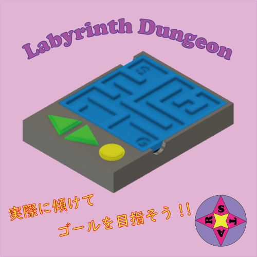

# Labyrinth Dungeon

本プロジェクトは、マイクロコンピュータと加速度センサー、3Dプリンタを用いた自作コントローラでプレイする、体験型ゲームです。コントローラとPCは有線接続およびBluetooth接続の切り替えが可能です。

## インストール方法

1. パッケージ化されたゲームをダウンロードします。
2. ゲームをインストールしたいディレクトリに展開します。

## 使用技術

このプロジェクトでは、以下の技術が使用されています:

- Arduino: シリアル通信により加速度センサーの値を取得します。
- ESP32: 加速度センサーから取得した値をBluetoothシリアル経由でUnityに送信します。
- Unity: 受け取った加速度センサーの値を使用して、プレイヤーの操作を制御します。

## ゲームの特徴

- 自作のジャイロコントローラーを使用して、プレイヤーを直感的にジャイロ操作できます。
- 現実世界の動きをゲーム内のプレイヤーキャラクターに反映することで、没入感のあるゲームプレイを実現しています。
- 
## メンバー情報

プロジェクトのメンバー情報については、[こちらのWebサイト](http://xd966971.html.xdomain.jp/)をご覧ください。

## 貢献方法

このプロジェクトへの貢献は、Pull Requestを作成してください。詳細なガイドラインについては、CONTRIBUTING.mdファイルを参照してください。

## ライセンス

このプロジェクトはライセンスを持っています。詳細については、LICENSEファイルを参照してください。
